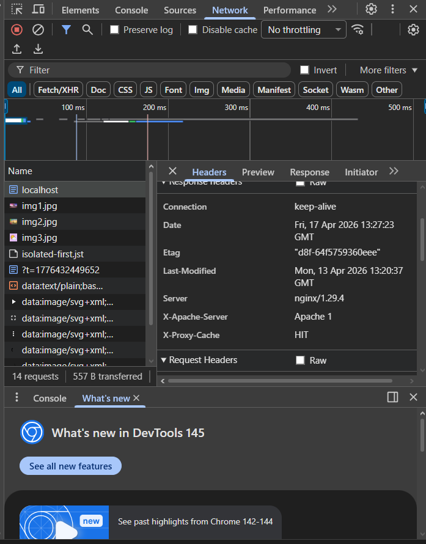

# Pràctica: Proxies amb Nginx

Aquest repositori conté la solució a la pràctica d'infraestructura de serveis web amb Docker Compose, implementant dos servidors Apache com a backend i un Nginx com a proxy invers amb balanceig de càrrega i memòria cau.

## Fases de Desenvolupament

### Fase 1: Un sol node web
Primer, es va crear l'estructura de la pàgina web estètica a `./html/index.html` amb una mica de disseny CSS i espais per a 3 imatges i 1 vídeo. Llavors es va afegir el primer contenidor de `httpd` (Apache) per servir aquest contingut.

### Fase 2: Segon node web
Es va afegir un segon contenidor Apache (`apache_backend_2`) idèntic al primer per poder oferir alta disponibilitat. Per distingir-los, es va afegir un sub-comandament a Docker que inyecta dinàmicament la capçalera `X-Apache-Server` en el fitxer de configuració de cada Apache al moment de l'arrencada ("Apache 1" al primer contenidor i "Apache 2" al segon contenidor).

### Fase 3: Volum compartit
Per garantir que ambdós nodes web serveixen exactament el mateix contingut (i reduir la redundància de dades), els dos contenidors Apache es van configurar en el `docker-compose.yml` de manera que mapegen el mateix directori host `./html` cap a la ruta `/usr/local/apache2/htdocs` dels seus respectius contenidors d'Apache.

### Fase 4: Proxy invers amb balanceig
S'ha creat el contenidor `nginx_proxy` amb el fitxer `nginx.conf` muntat com a volum. Hem configurat un bloc `upstream backend_apache` que inclou els dos contenidors Apache per defecte, l'algoritme que utilitza Nginx quan no s'especifica res és **Round Robin**. Les peticions entren a Nginx pel port 80 de la màquina host i ell les reparteix.

### Fase 5: Memòria cau (Proxy Cache)
A la configuració de l'Nginx (`nginx.conf`) hem establert `proxy_cache_path` per habilitar l'ús de la memòria cau i es va aplicar un `proxy_cache_valid` per a mantenir les respostes un temps. Això ajuda enormement al rendiment en fitxers estàtics com imatges i vídeos. Hem utilitzat la directiva automàtica d'Nginx `$upstream_cache_status` inyectada en la capçalera de proxy `X-Proxy-Cache` per visualitzar-ho fàcilment des del navegador i inspeccionar el HIT / MISS de les peticions en memòria.

## Problemes Trobats
* **Dificultat per distingir els contenidors**: En tenir un volum estricte compartit pel mateix document HTML, no es podien tenir arxius diferents i per tant no podiem posar noms diferents als index. La solució més eficient ha estat l'ús de `mod_headers` per injerir al vol el nom del servidor i recuperar-ho des del costat del client amb Javascript.

---

## Evidències de Funcionament

> [!IMPORTANT] 
> **(PROFESSOR)** A continuació es mostren les captures de pantalla que demostren el funcionament requerit.

### 1. Web funcionant amb balanceig actiu
*(Aquí afegeix una captura de la pàgina on es vegi l'etiqueta dinàmica mostrant "Apache 1" o "Apache 2")*

### 2. Capçaleres HTTP del balancejador i Servidor Backend
*(Afegeix una captura de la pestanya "Xarxa" del navegador on es vegin les capçaleres de resposta `X-Apache-Server` o `X-Backend-Server` demostrant l'origen de la resposta)*

### 3. Memòria Cau Nginx (HIT / MISS)
*(Captura de la mateixa pestanya on es demostri que les fotos / recursos i la web retornen la capçalera `X-Proxy-Cache: HIT` un cop ja s'han sol·licitat previament)*

